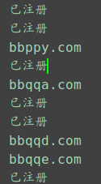

# Domain-tool

这是一个域名查询程序小工具

在这个工具中

你能批量查询域名

来寻找发现你钟意的域名

为了**不被薅羊毛割韭菜**

自己动手查询

发现完美的域名还很多

四位数的纯英文字母的域名有四十五万个

基本上四位数的注册不到了

但是五位数的域名有一千一百八十多万个

自己细心找找

总会有好的域名

### 使用方法

1.下载仓库

	git clone https://github.com/BeyondLam/Domain-tool	

2.进入仓库

	cd Domain-tool

3.弄一个虚拟环境

	python3 -m venv venv

4.激活虚拟环境
 
 	source venv/bin/activate

5.下载依赖包

	pip install bs4

6.运行代码
	
	python find_domain.py
	
### 结果
终端能打印出类似的信息

打印出来的域名就是未注册的

并且在同目录下会有一个data.txt文件生成

里面的内容就是未注册的域名
